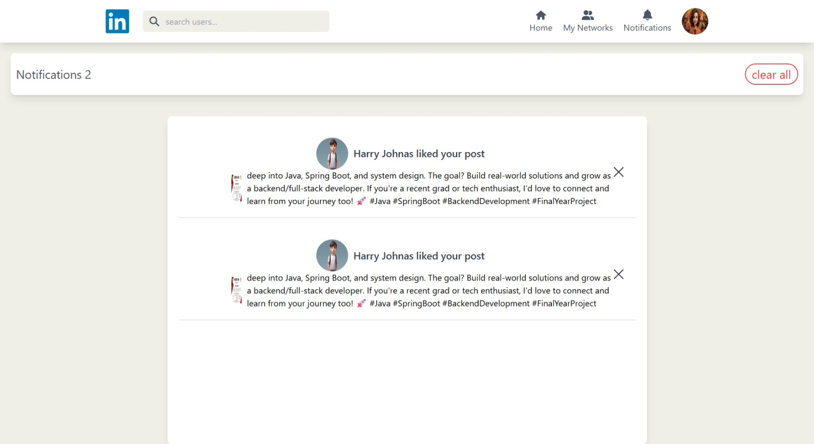

# LinkedIn Clone

A full-stack LinkedIn Clone built using **MERN Stack**.  
Users can create posts, like, comment, and connect — just like the real LinkedIn.

## 🚀 Live Demo
🔗 [View Live Project](https://linkedin-frontend-m27s.onrender.com)

## 🛠️ Tech Stack
- MongoDB
- Express.js
- React.js
- Node.js
- Render

## 📸 Project Screenshots  

<p align="center">
  
  <br/><b>📝 Sign Up Page</b>
  <br/><br/>

  
  <br/><b>🔑 Sign In Page</b>
  <br/><br/>

  
  <br/><b>🏠 Home Page</b>
  <br/><br/>

  
  <br/><b>🧾 Post Page</b>
  <br/><br/>

  
  <br/><b>❤️ Like & Comment Feature</b>
  <br/><br/>

  
  <br/><b>🔔 Notification Page</b>
  <br/><br/>

  
  <br/><b>👤 Profile Page</b>
  <br/><br/>

  
  <br/><b>🤝 Connection Request Page</b>
</p>


## 🧑‍💻 Setup Locally

Follow these steps to run the project on your local machine:

```bash
# Clone the repository
git clone https://github.com/your-username/your-repo-name.git

# Navigate into project folder
cd your-repo-name
1️⃣ Backend Setup
cd backend
npm install

Create a .env file inside the backend folder and add:
PORT=5000
MONGO_URI=your_mongodb_connection_string
JWT_SECRET=your_secret_key
CLOUDINARY_NAME=your_cloudinary_name
CLOUDINARY_API_KEY=your_cloudinary_api_key
CLOUDINARY_API_SECRET=your_cloudinary_api_secret

Then run:
npm run dev

2️⃣ Frontend Setup (Vite + React)
cd ../frontend
npm install
npm run dev
